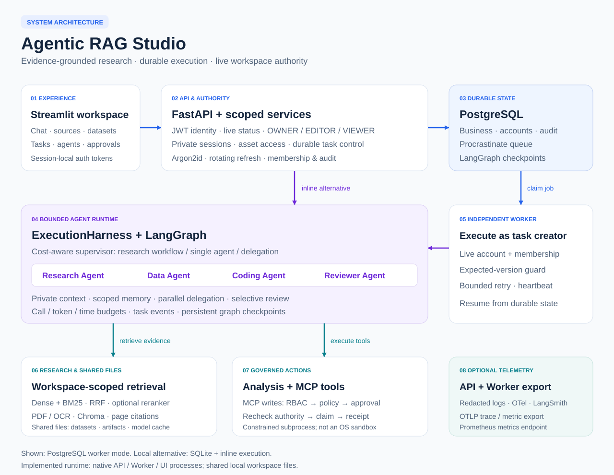
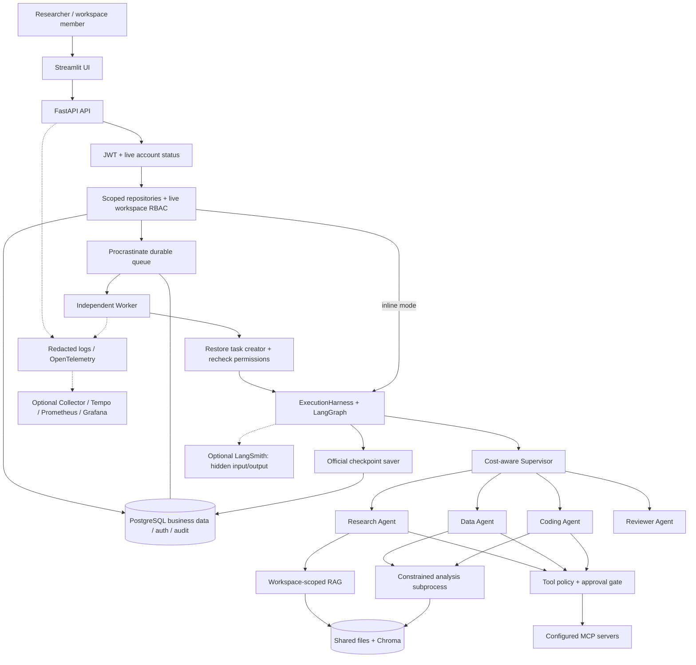
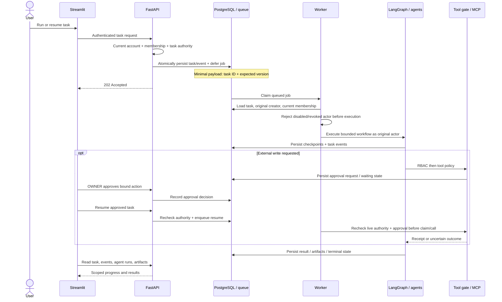
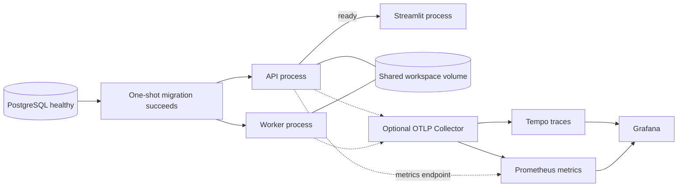

# Agentic RAG Studio architecture

This document describes the assembled Phase 5B-2 system. The overview uses PostgreSQL and an independent background worker. SQLite/inline execution remains available for local development. The native process topology has been exercised; Docker/Compose runtime acceptance remains pending.

[SVG](assets/architecture.svg) · [PNG](assets/architecture.png) · [Diagram generator](../scripts/render_architecture.py)

## System boundaries

The API owns the HTTP and authorization boundary. Streamlit stores access/refresh tokens in server-side session state. Tokens carry identity; roles come from live membership queries. The worker restores the original task creator rather than using an unrestricted service identity. Graph/tool execution shares this actor context through the execution harness.

## Durable task lifecycle

Pause/resume/cancel is durable task control. Read-only transient failures have bounded retries. An ambiguous external write enters reconciliation rather than being blindly replayed. A database check and a remote provider's side effect cannot form one distributed transaction; permission revocation after dispatch cannot unsend the request.

## Research and evidence flow

```mermaid
flowchart LR
    Upload[Validated PDF upload] --> Extract[Native text / optional OCR]
    Extract --> Chunk[Chunks + document / physical-page metadata]
    Chunk --> Index[Per-document persisted Chroma + BM25]
    Question[Question + selected documents] --> Route[Intent analysis / optional planner]
    Route --> Recall[Bounded per-document recall]
    Index --> Recall
    Recall --> Fuse[RRF fusion + optional global reranking]
    Fuse --> Grade[Evidence sufficiency check]
    Grade -->|bounded rewrite / replan| Recall
    Grade --> Generate[Generate grounded answer]
    Generate --> Verify[Grounding check + bounded revision]
    Verify --> Cite[Citation validation against current evidence]
    Cite --> Answer[Answer + document/page references]
```

Only authorized, selected workspace documents participate in retrieval. Physical page metadata survives extraction and OCR. Personal memory supplies preferences/context and is not citation evidence. External fallback follows source policy; document-only questions stay within document evidence. The workflow reports insufficient evidence when its bounded correction path cannot establish support.

## Persistence responsibilities

| Store | Responsibility | Recovery implication |
| --- | --- | --- |
| PostgreSQL business schema | Workspaces, sessions, documents, datasets, tasks/events, memory, artifacts, tool actions, agent runs, accounts, memberships, audit | Alembic-managed; explicit legacy ownership assignment |
| Procrastinate schema in PostgreSQL | Durable jobs, attempts, worker heartbeat | SDK-managed; task version and creator checked at execution |
| LangGraph PostgreSQL saver | Graph checkpoints and pending writes | Official SDK schema; supports workflow restoration |
| Shared workspace filesystem | PDFs, Chroma indexes, datasets, generated artifacts | API and Worker need the same paths; back up with the database |
| Model cache | Embedding, reranking, optional OCR weights | Re-downloadable; persistent cache avoids repeated downloads |
| SQLite local mode | Local business/session state and checkpoints | Development alternative; no independent PostgreSQL worker queue |

Queue/checkpoint initialization is idempotent SDK setup after business migrations; it is not one transaction spanning all three schemas. Deployment must finish migration before starting API/Worker. A database-only restore does not reconstruct referenced files or Chroma indexes.

## Agent execution and authority

The supervisor chooses the existing research workflow, single-agent execution, or bounded delegation. Research, Data, Coding, and Reviewer agents use structured contracts, private context budgets, and restricted tool sets. Independent delegations may run concurrently. Risk-based review, duplicate detection, and task-local caching reduce unnecessary calls; configured aggregate budgets cap the full run.

Authorization is enforced at three points:

1. **HTTP/resource access:** authenticated identity, live status/membership, creator-bound sessions/tasks, and scoped lists/downloads.
2. **Queued execution:** the durable creator is restored and rechecked before the graph starts; queued access is not a permanent permission grant.
3. **Side effects:** live RBAC precedes tool policy and human approval; approved external writes recheck authority before claim/call.

OWNER controls membership and may approve external writes. EDITOR can modify assets and run analysis. VIEWER can read assets and run their own read-only tasks. Personal sessions/memory remain private regardless of workspace role. See the [complete security model](PHASE5B2_SECURITY.md).

## Process and deployment view

API and Worker export telemetry independently. Logs redact credentials and payloads; exported spans use a restricted attribute set. Metrics avoid user/workspace/query IDs as dimensions. Collector outages do not fail core requests. Optional LangSmith keeps input/output hidden by default. Monitoring definitions describe the intended container topology; the local smoke scenario exercised real OTLP receipt, not a live Grafana/Tempo stack.

The Compose definition uses non-root processes, read-only source, loopback-published ports, separate database/application volumes, and health-gated startup. These settings still need container acceptance. The constrained analysis subprocess is **not an OS security sandbox**. Shared filesystem access and analysis execution currently assume trusted teams; public hostile-code isolation and HA need additional work.

## Source navigation and evidence

| Concern | Entry points |
| --- | --- |
| HTTP composition | [`server/main.py`](../server/main.py), [`server/api.py`](../server/api.py) |
| Accounts and authority | [`server/auth/`](../server/auth/), [`server/manage.py`](../server/manage.py) |
| Persistence and migrations | [`server/db/`](../server/db/), [`alembic/`](../alembic/), [`server/migrate.py`](../server/migrate.py) |
| Durable task/worker execution | [`server/tasks.py`](../server/tasks.py), [`server/task_queue.py`](../server/task_queue.py), [`server/worker_runtime.py`](../server/worker_runtime.py) |
| Graphs and specialists | [`server/agent/`](../server/agent/), [`server/agent_registry.py`](../server/agent_registry.py) |
| Retrieval and analysis | [`server/rag/`](../server/rag/), [`server/analysis_runtime.py`](../server/analysis_runtime.py) |
| Tool governance | [`server/tool_policy.py`](../server/tool_policy.py), [`server/tool_actions.py`](../server/tool_actions.py), [`server/mcp_client.py`](../server/mcp_client.py) |
| Infrastructure telemetry | [`server/observability/runtime.py`](../server/observability/runtime.py), [`observability/`](../observability/) |

[Validation snapshot](PHASE5B2_VALIDATION.md) · [Deployment runbook](PHASE5B2_DEPLOYMENT.md) · [Migration guide](PHASE5B1_MIGRATION.md)
