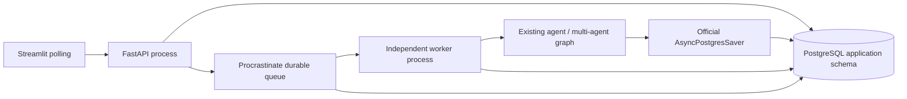
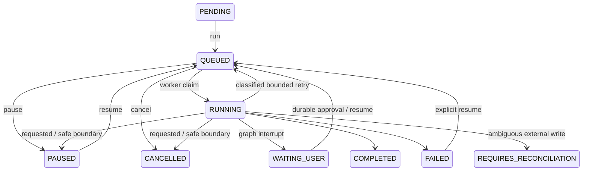

# Phase 5B-1 implementation

## Architecture

SQLite/inline remains the default. PostgreSQL/worker is an opt-in reversible
deployment configuration. No Redis/Celery, new agents, external integrations,
vector migration, authentication, cloud deployment or Phase 5B-2 work.

## Persistence and repository layer

`server/db/repositories.py` defines workspace, session, memory, task, dataset,
artifact, approval, execution, run, delegation and MCP Protocols and a composition
factory. Existing domain-specific store classes retain their Pydantic/domain
models and validation. Their common Database connection port selects SQLite or
a pooled SQLAlchemy PostgreSQL implementation. Services and graphs do not select
database drivers. This deliberately shares domain behavior rather than duplicating
the entire existing store implementation in a second hierarchy.

Legacy SQL portability is bounded to audited application queries in
`RelationalConnection`: named binds, explicit columns from versioned metadata,
JSONB/TIMESTAMPTZ casts, INSERT IGNORE portability and stable insertion ordering.
It rejects PostgreSQL DDL/PRAGMA, so old schema initializers cannot silently create
partial production schemas. Legacy SQLite initialization is preserved.

Sync SQLAlchemy engine/pool serves synchronous graph nodes and domain stores in
threads. Async SQLAlchemy engine/AsyncSession serves atomic HTTP queue/control
transactions and health. Engines are process-scoped; connection pools are reused,
startup checks migration/queue/checkpoint readiness, and shutdown disposes them.
No engine is created per request. Existing synchronous routes run in FastAPI's
thread pool; async routes dispatch legacy execution with `asyncio.to_thread`.

`BEGIN IMMEDIATE` in legacy short mutation paths maps to one PostgreSQL transaction
advisory mutex, preserving their existing serialization across processes. This is
a conservative first-stage contention limit: unrelated writes can serialize.
Queue claims also lock task rows and task updates check optimistic versions.
No database transaction is held during model/tool/analysis execution.

## Schema and migrations

Alembic revision `5b1_0001` creates 16 application tables. `schema_v1.py` freezes
the baseline; later schema changes require new revisions. Existing IDs remain
TEXT. JSON payloads, messages, embeddings and document metadata use JSONB; real
SQL timestamps use TIMESTAMPTZ and connections use UTC. Application payloads
retain backward-compatible ISO timestamp strings. PKs, NOT NULLs, FK relationships,
intent-key uniqueness, dataset/document uniqueness and step-index uniqueness are
enforced. Indexes cover actual status/workspace/task/delegation/scope queries.

Task projections include version, queue_job_id, queued_at, worker_started_at,
attempt_count and execution_backend. Payload fields remain the domain contract;
repository writes update projections in the same transaction. Stable insertion
order has an identity column, replacing SQLite's implicit rowid semantics.

Alembic owns only application schema. Procrastinate SchemaManager owns the queue
schema. Official AsyncPostgresSaver.setup owns checkpoint schema. `worker --setup`
initializes these latter schemas explicitly; regular startup checks them without
copying SDK SQL into application migrations. SDK upgrades require their official
migration procedures, not an application Alembic downgrade.

## Checkpoint factory

SQLite retains ManagedSqliteSaver. PostgreSQL selects AsyncPostgresSaver with
the existing redacting serializer and a small async psycopg pool. Because the
existing graph is synchronous, a small BaseCheckpointSaver bridge submits only
public SDK calls to one owned Selector event loop. Actual checkpoint serialization,
storage, pending writes and setup remain in the official saver.

Legacy checkpoint tuples/pending writes/subgraph namespaces have not been safely
import-verified across saver types. Internal checkpoint tables are excluded from
application migration. Migration blocks resumable legacy tasks; their SQLite saver
is retained. New PostgreSQL tasks start on PostgreSQL checkpoints.

## Atomic queue and duplicate prevention

`TaskQueue` has InlineTaskQueue and PostgresTaskQueue. Worker mode `/run` and
`/resume` return 202 with QUEUED task data immediately after commit. Queue payload
contains task_id and expected_version only; max_steps/approval data stays in DB.

One AsyncSession transaction takes the mutation mutex/task row lock, validates
state and pending approvals, calls Procrastinate external-connection defer on
SQLAlchemy's underlying psycopg connection, writes QUEUED task/projections and
TASK_ENQUEUED event, then commits. Any failure rolls back **all** writes. Queue
notifications are PostgreSQL transactional notifications and become visible at
commit. No compensating-update or outbox eventual-consistency path is used.

Native queueing_lock/execution lock are `task:<id>`. Concurrent `/run` calls yield
one job and one 409. The worker checks persisted job ID and queued generation,
task state, cancellation, local owner, workspace and session relation before
executing. Stale/missing/terminal deliveries do no agent work.

## Worker, retries and crash recovery

`python -m server.worker` launches a separate process with bounded concurrency
(default 2), official worker heartbeats (10s) and stalled-worker cutoff (30s).
Per-process multi-agent parallelism is separately bounded (default 3), so the
default maximum is 2 task workflows × 3 delegated branches, within existing
call/token/time budgets. This is not global autoscaling or a fleet-wide budget.

Retry classification: transient reads/model/network/database failures can retry
up to WORKER_MAX_RETRIES; validation, unsafe code, missing data and policy failures
do not retry. Only a sanitized RetryableTaskError enables framework retry. Read
tool error types are inspected for the current failed step; arbitrary tool errors
are not classified as transient. RUNNING/FAILED external write/delete/execute
claims conservatively require reconciliation and cannot automatically replay.

Startup and the framework periodic recovery task use official `get_stalled_jobs`
with heartbeats, then official retry/finish APIs. They do not classify a long
task as dead by task age. Recovery reuses application completed steps and saved
graph/agent progress. Completed read steps are deduplicated; uncheckpointed reads
may repeat. Exactly once for arbitrary external side effects is not claimed.

Graceful stop calls official Worker.stop and drains with a configurable timeout.
SIGINT/SIGTERM are handled explicitly. WORKER_STOP_FILE is an optional operator
control for Windows/testing. It contains no business payload. Hard termination
uses heartbeat recovery. API startup does not run global task/run recovery in
worker mode; restarting API cannot pause a live worker task.

## State/control/HITL

Pause/cancel requests persist flags. Queued jobs are cancelled via the framework
on the same transaction connection. Running tasks stop at completed-step or
multi-agent-group boundaries; workers are not force-killed for task cancellation.
Completed agent results are retained. HITL jobs end at WAITING_USER and release
their queue lock. Decisions are persisted before queue resume; worker invokes
the existing Command resume path. Existing intent hash/claim/approval consumption
guards remain. If defer fails after a decision commits, explicit `/resume` retries
enqueue; the human decision is not lost and no external write is executed by API.

## Health and observability

`/health/live`: process alive. `/health/ready`: DB/revision and queue usable;
worker availability is shown but does not block enqueue readiness. `/health` also
includes queue depth, running jobs, live-worker heartbeat and database health.
SQLAlchemy/psycopg/queue failures return sanitized 503; duplicate enqueue 409.
Trace events retain task/agent/delegation/approval/tool IDs and add job ID,
queued/start times, queue_wait_ms, worker ID, attempt and retry_reason. No DSN,
password or provider key is returned. SQLAlchemy hides bind parameters. Failure
events persist exception types instead of secret-bearing exception messages.

Streamlit reads durable status, supports QUEUED pause/cancel and manual refresh,
and shows worker job/attempt fields. Browser lifetime does not own execution.

## Windows entry points

Use `python -m server.api` and `python -m server.worker`. Uvicorn >=0.36 chooses
Proactor by default even with `loop=asyncio`; the API launcher explicitly supplies
a Selector factory for psycopg. The global event-loop policy is left intact so
MCP stdio subprocesses in graph threads continue to use Windows Proactor support.
