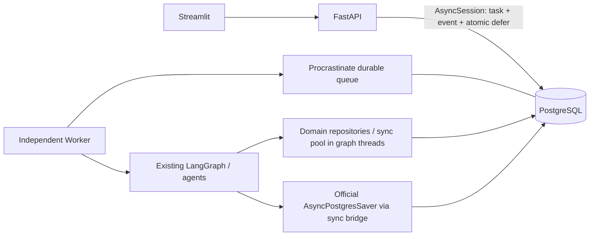
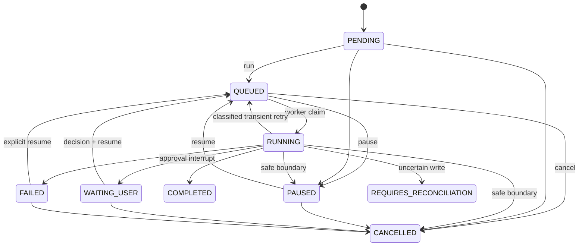

# Phase 5B-1 — A–V acceptance report

2026-10-03. Run `f60ebc6873f64c94a02d91c4ad60073e`. Evidence: [process result](../evaluation/results/phase5b1/runtime_smoke.json),
[pre-development audit](PHASE5B1_PRE_DEVELOPMENT_AUDIT.md), [architecture](PHASE5B1_IMPLEMENTATION.md),
[migration/rollback](PHASE5B1_MIGRATION.md). Local raw logs are retained under `.runtime/phase5b1-*`.

## A. Final Verdict

**READY WITH LIMITATIONS**. PostgreSQL + independent worker foundation passes the required integration and crash acceptance.
SQLite/inline remains the reversible default; existing data has not been cut over.

## B. Architecture

API does not launch a worker. Queue contains only `task_id` and `expected_version`.
Files and Chroma remain in local filesystem paths.

## C. Technology Decisions

| Component | Actually verified version | Decision |
| --- | --- | --- |
| PostgreSQL | 17.11 | Official local Windows binaries; relational state and queue share a database |
| SQLAlchemy | 2.0.45 | One process-owned sync/async engine pair; async queue transaction |
| psycopg | 3.3.6 | Single PostgreSQL driver for SQLAlchemy, saver and queue |
| Alembic | 1.20.0 | Application schema revision and explicit upgrades |
| langgraph-checkpoint-postgres | 3.0.5 | Official AsyncPostgresSaver and setup API |
| Procrastinate | 3.10.0 | Official external-connection deferral, locks, retry and heartbeat recovery |
| LangGraph | 1.0.5 | Existing 1.0.5 graph retained |

Procrastinate is pinned in `uv.lock`; Windows Selector loops are scoped to API/worker/saver.
The global policy remains intact for MCP subprocesses. Dependency compatibility sources are linked in the audit.

## D. Repository Migration

Workspace, Session, Memory, Task/Step/Event, Dataset/Analysis/Artifact, Approval/ToolExecution,
AgentRun/Delegation, MCPServer and index metadata now share backend-neutral domain repositories.
Domain Protocols and RepositoryFactory define the composition boundary; domain models remain Pydantic/dataclasses.
The PostgreSQL query port uses SQLAlchemy transactions and typed binds; it is not a driver name replacement.
Sync domain methods run in graph/FastAPI threads; enqueue/control/health use AsyncSession.
Direct `sqlite3.connect` remains only in the explicit SQLite fallback and ManagedSqliteSaver;
migration reads SQLite through a read-only URI. Chroma internals are unchanged.

## E. Database Schema

16 business tables: workspaces, sessions, workspace_documents, tasks, task_steps, task_events,
long_term_memories, data_assets, analysis_executions, artifacts, tool_executions, approval_requests,
agent_runs, agent_delegations, mcp_servers, indexes.
16 primary keys, 18 foreign-key constraints, 22 unique constraints (including 16 identity-order columns),
16 explicit query indexes and appropriate NOT NULL constraints.
JSON text becomes JSONB, relational timestamp columns are TIMESTAMPTZ/UTC; existing IDs and file metadata remain.
Task projections add version/job/timing/attempt/backend fields. `_order` preserves former rowid ordering.

## F. Alembic

Revision `5b1_0001`; baseline uses frozen `schema_v1` metadata.
`upgrade head`, `downgrade base`, then `upgrade head` passed on a new empty fixture database.
No business database was downgraded. Procrastinate uses official SchemaManager;
LangGraph uses official AsyncPostgresSaver.setup. Neither SDK schema is copied into Alembic.

## G. SQLite → PostgreSQL

[Existing-data migration](generated/POSTGRES_EXISTING_DATA_MIGRATION.md): all 16 tables validated,
222 source rows → 222 destination rows, all table counts/checksums PASS.
This imported read-only backup copies into a new isolated database. Original SQLite unchanged: **True**.
[Synthetic fixture migration](generated/POSTGRES_MIGRATION_REPORT.md) additionally contains nonempty
Approval, ToolExecution, AgentRun and Delegation rows; original IDs are asserted by integration tests.
Dry-run does not write destination; nonempty destination aborts by default; collisions always abort/roll back.
Warnings for existing data: old `checkpoints` and `writes` SDK tables deliberately ignored.
File bytes and vector embeddings are not migrated. Source schema user_version=0, destination=5b1_0001.

## H. LangGraph Checkpoint

CheckpointFactory selects ManagedSqliteSaver or the official AsyncPostgresSaver bridge.
Real graph invocation/get_state and persisted HITL Command resume passed against PostgreSQL.
Old checkpoint stores are retained; importing SDK internals is not claimed safe.
Migration blocks resumable legacy tasks until completed/cancelled; new PG tasks use new PG checkpoints.

## I. Queue

Same AsyncSession transaction holds the mutation mutex and task row lock, updates task/event,
and passes its underlying psycopg connection to official defer_async; one commit publishes all changes.
Native queueing lock prevents duplicate pending jobs; native execution lock prevents overlapping task execution.
Version/job generation checks reject stale delivery. Only known transient read/transport failures retry,
bounded by WORKER_MAX_RETRIES (default 2). Invalid input/configuration/policy failures do not retry.
Confirmed ambiguous external writes enter REQUIRES_RECONCILIATION.
Official worker heartbeat updates every 10s; dead-worker cutoff 30s; SDK stalled-job detection and retry/finish APIs
run at startup and through the framework periodic task. Healthy long-running tasks are not classified by elapsed duration.

## J. Worker

`python -m server.worker` is a separate process, default concurrency=2.
`--setup` initializes SDK schemas; `--recover-only` performs official stalled recovery.
Signals/optional operator stop file request official Worker.stop and drain, default grace=120s.
Hard crash resumes safe work; completed first step was invoked exactly once.
Every delivery validates task status, job generation, cancellation, workspace/session relationship and owner.

## K. Task State Machine

Worker resume always enqueues; inline legacy additionally permits PENDING/PAUSED/WAITING_USER/FAILED → RUNNING.
Cancellation/pause while running set durable flags and settle at safe boundaries.

## L. API

Worker `/tasks/{id}/run` and `/resume`: 202 after atomic enqueue, duplicate/illegal run: 409.
SQLite inline routes preserve synchronous-result behavior using threads.
`/pause` and `/cancel` persist cooperative controls and cancel queued jobs through SDK.
`/health/live`: process; `/health/ready`: DB revision + queue availability;
`/health`: queue depth, doing jobs, active-worker heartbeat. Worker absence is visible but enqueue remains available.
DB/queue errors return sanitized 503. API startup does not interrupt worker-owned tasks.

## M. Atomicity Validation

**PASS**: task mutation attempted then defer fails → task remains PENDING, no extra event, no job.
**PASS**: actual defer succeeds then task save raises → outer transaction rolls back job and task/event changes.
**PASS**: two concurrent enqueues → one job, one accepted request and one conflict (202/409).

## N. Crash Validation

API hard kill while second step executes: PASS; worker completes, restarted API reads completed task.
Worker graceful restart: PASS. Worker hard kill on read: PASS, attempt_count=2, completed step call count=1.
Transient read: PASS (2 attempts). Invalid input: PASS (1 attempt).
Ambiguous mock write hard kill after side effect: PASS; task=REQUIRES_RECONCILIATION,
shared mock ledger has 2 writes before recovery and 2 after (one earlier approved task plus one uncertain task).
No blind replay. Tests use local mock writes, never real GitHub mutations.

## O. HITL

WAITING_USER persists approval and graph interrupt. Worker stops, approval persists and enqueues resume,
replacement worker completes. Approved mock action execution count=1. Pending decisions block direct resume.
An enqueue outage after a durable approval may require explicit resume; approval is not lost.

## P. Multi-Agent Background

Task queued → Research + Data delegations execute in existing graph → COMPLETED.
Real pandas analysis subprocess and chart artifact complete; result persists after API/worker restart.
Existing Task → AgentRun → Delegation → ToolExecution relationships remain available.
No new agents or integration tools were introduced.

## Q. Tests

| Group | Total | Passed | Failed | Skipped |
| --- | ---: | ---: | ---: | ---: |
| Previous baseline | 437 | 437 | 0 | 0 |
| New offline tests | 25 | 25 | 0 | 0 |
| Ordinary full discovery | 479 | 462 | 0 | 17 |
| Real PostgreSQL integration, explicit opt-in | 17 | 17 | 0 | 0 |
| Combined distinct tests | 479 | 479 | 0 | 0 |

New total=42 (25 offline + 17 PG). PostgreSQL suite is explicitly run, so its normal skip is not missing acceptance.
Compilation and locked dependency check passed. Test fixtures exercise real SQLAlchemy/SDKs and pools.

## R. Runtime Smoke

**30/30 PASS; zero FAIL/SKIPPED.** LLM and document retrieval are deterministic fixtures;
PostgreSQL, Alembic, independent API/worker/Streamlit, queue, graph/checkpointer, MCP SDK and analysis subprocess are real.

| # | Check | Result |
| ---: | --- | --- |
| 1 | PostgreSQL starts | PASS |
| 2 | Alembic upgrade head | PASS |
| 3 | Queue schema initialized | PASS |
| 4 | PostgresSaver initialized | PASS |
| 5 | FastAPI postgres/worker starts | PASS |
| 6 | Independent worker starts | PASS |
| 7 | Streamlit starts | PASS |
| 8 | Task creation | PASS |
| 9 | Run returns 202 | PASS |
| 10 | Task QUEUED | PASS |
| 11 | Worker RUNNING | PASS |
| 12 | Task completes | PASS |
| 13 | API restart independent | PASS |
| 14 | Streamlit stop independent | PASS |
| 15 | Worker graceful restart | PASS |
| 16 | Worker hard crash read recovery | PASS |
| 17 | Completed step not repeated | PASS |
| 18 | Pause | PASS |
| 19 | Queue resume | PASS |
| 20 | Cancel queued task | PASS |
| 21 | HITL WAITING_USER | PASS |
| 22 | Approval queue resume | PASS |
| 23 | Approved write exactly once | PASS |
| 24 | Research + Data background | PASS |
| 25 | Persistence after restart | PASS |
| 26 | SQLite migration dry-run | PASS |
| 27 | SQLite fixture migration | PASS |
| 28 | Row/checksum verification | PASS |
| 29 | Duplicate run requests | PASS |
| 30 | DB/queue health | PASS |

## S. Performance

Measured loopback Windows smoke, milliseconds; samples are small and include deliberate restarts/crash delays.
Enqueue clock uses Windows time.time and is quantized (0 does not imply a zero-time request).
Queue wait includes worker initially absent and a 32s intentional dead-worker wait; this is not a throughput benchmark.
Pure DB timing includes Task creation + event persistence, excluding HTTP reads.

| Measurement | n | Median ms | Min–max ms |
| --- | ---: | ---: | --- |
| enqueue_ms | 10 | 31.000 | 0.000–47.000 |
| queue_wait_ms | 5 | 6341.207 | 6.574–38619.496 |
| sqlite_task_create_ms | 10 | 2.103 | 2.025–2.478 |
| postgres_task_create_ms | 10 | 1.227 | 0.820–2.804 |

Worker process startup → first RUNNING claim: **6332.021 ms** (includes imports/MCP discovery).
No PostgreSQL-versus-SQLite performance superiority is inferred.

## T. Known Limitations

Single local PostgreSQL acceptance; no cloud, HA/failover, sustained-load or authenticated deployment qualification.
Local artifacts/Chroma require shared paths for API/worker; no Auth/RBAC/multi-user/distributed autoscaling.
Legacy synchronous repositories use a conservative advisory write mutex, serializing unrelated short mutations;
large collection scans still occur in several inherited repositories. Future scaling should deepen indexed query methods.
Old checkpoints are retained, not imported. Ambiguous side effects require manual reconciliation; no exactly-once claim for external SaaS.
SDK schema upgrades are operator-controlled; existing Procrastinate schema is not automatically upgraded at API startup.
Real LLM/provider network reliability and live GitHub writes were not evaluated in this fixture smoke.
No Phase 5B-2 features were started.

## U. Phase 5B-2 Readiness

PostgreSQL is ready as the selected backend for a controlled single-host deployment after explicit maintenance cutover;
it has not been made the irreversible/default backend. Worker mode is ready within these verified boundaries.
Phase 5B-2 can start as separate work after operator accepts local-file and access-control constraints.
This delivery does not begin Phase 5B-2 or switch existing production data.

## V. Git Status

**Not committed. Not pushed.** Existing dirty Phase 1–5A.5 working changes retained.
No reset, SQLite/Chroma/business-asset deletion or `.env` overwrite; diff --check passes.
Compose/commands and rollback path are documented; local test DBs, reports and crash artifacts are retained.
The isolated test PostgreSQL cluster is stopped after acceptance; application services used by the harness are stopped.
