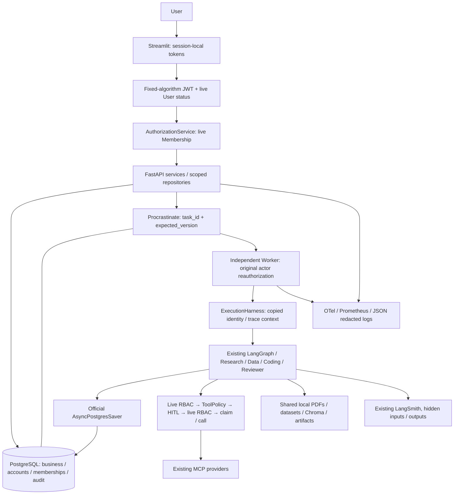

# Phase 5B-2 implementation

The existing Agent workflows, MCP providers, analysis runner, LangGraph version,
PostgreSQL queue and checkpoint implementation remain in place. Authentication
and live workspace authorization surround their existing service/repository ports.
No new Agent, provider, SaaS integration, Redis, Celery or Chroma migration was added.

## Code boundaries

`server/auth/service.py` owns Argon2 accounts, JWT validation, opaque refresh
rotation, replay revocation and password changes. `AccountStore` owns short
transactions and allowlisted audit metadata. No credential or role enters queue
arguments. `AuthenticatedPrincipal` contains identity only; `SystemExecutionContext`
binds an actor to one task and grants no administrator bypass.

`AuthorizationService` defines stable capabilities and the three roles.
`ScopedRepository` checks existing store methods, scopes list results, stamps
creators and disregards caller-supplied owner IDs.
Lists read memberships once per list operation rather than once per returned
workspace/session/task; mutation and tool boundaries still recheck current roles.
Trusted internal transaction methods remain private maintenance ports; these Python objects are not a sandbox
against hostile code with process/filesystem access.

API authentication covers all business paths. Root, health, credential endpoints
and internal metrics remain public; production docs are disabled. Direct Task,
Session, ingestion and analysis service calls also require an authorized actor.
Upload and analysis permissions are checked before indexing, directory creation
or analysis subprocess execution. Artifact receipts are persisted before child
artifact rows, satisfying the real PostgreSQL foreign key.

The Worker checks task/workspace/private-session relations, live user state and
membership before execution. The original actor passes through asyncio threads,
the ExecutionHarness thread pool and LangGraph nodes. External writes recheck
live permissions immediately before claiming the durable execution receipt.
The existing no-blind-retry rule for ambiguous writes remains.

## Database compatibility

`schema_v1.py` and revision `5b1_0001` are frozen. `schema_v2.py` and revision
`5b2_0001` add four auth tables and nullable creator foreign keys. Existing business
IDs, paths, payloads and legacy ownership remain unchanged. Health fails when the
application schema is behind. SQLite auth DDL is additive and runs only when auth
is enabled; auth-disabled legacy SQLite construction follows its previous path.

The old SQLite-to-PostgreSQL importer deliberately reads the frozen 16-table
business schema. It does not import account hashes or refresh-token data; legacy
ownership is a separate explicit operator action. Authenticated SQLite account
cutover is outside this legacy importer and needs a separate account migration.

SQLite `BEGIN IMMEDIATE` and the existing PostgreSQL advisory transaction mutex
serialize short refresh and membership updates. Password hashing and LLM calls
stay outside the mutex. The mutex is database-wide and may limit high write load;
this phase does not add a distributed cache or claim horizontal scale.

## UI and telemetry

Streamlit supports login, optional registration, logout and one refresh/retry,
including file rewind. Logout or failed refresh clears token, history and workspace
state. Tokens stay in the server's Streamlit session; no token URL/download/log.
The same `AUTH_ENABLED` setting must reach Streamlit and API. Role-aware controls
disable disallowed writes, show the current role and allow OWNER to add existing
accounts; APIs support change/removal. Authenticated UI uses workspace sessions.

Infrastructure spans use an allowlist, strip SQL text/bodies/headers/events/status
descriptions and correlate request/user/workspace/task/job/agent/delegation/tool IDs.
These IDs are trace/log fields, never metric labels. Task metadata carries a W3C
traceparent/request ID across the durable queue. API and Worker have separate
process-owned providers and metric registries. Collector OTLP aggregation supplies
Worker metrics; API `/metrics` alone does not aggregate Worker process counters.

The container image, five-service Compose stack, optional observability profile
and CI/release files are prepared. Docker/WSL installation and actual image/Compose
execution were explicitly deferred by the user; native validation is not labelled
as a container execution result. See the deployment and A–W validation reports.
