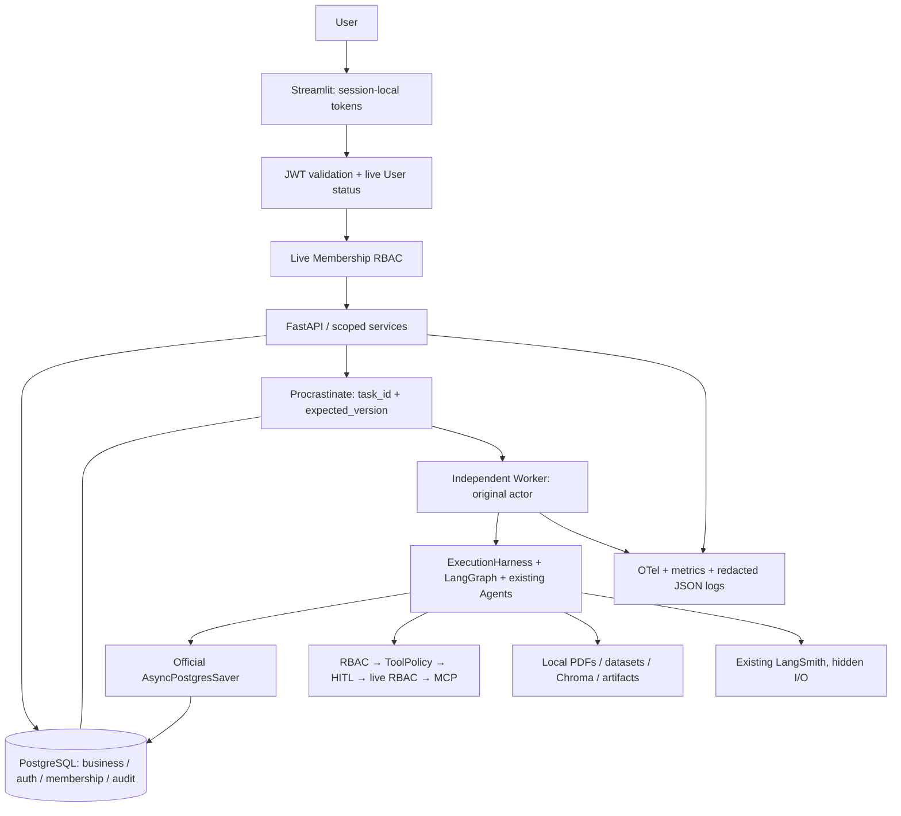

# Phase 5B-2 — A–W 验收报告

日期：2026-10-03。最终运行 ID：`f53ace2961be4868b651018bcc303ed6`。
证据：[运行结果](../evaluation/results/phase5b2/runtime_smoke.json)、
[原文件保护](../evaluation/results/phase5b2/preservation.json)、
[构建输入静态扫描](../evaluation/results/phase5b2/build_context_scan.json)。
原始测试/进程日志保留在 `.runtime/phase5b2/` 和运行结果中的独立工作目录。

## A. Final Verdict

**READY WITH LIMITATIONS**。鉴权、多用户隔离、RBAC、真实 PostgreSQL/独立 Worker
及本机观测验收通过。用户明确要求暂不处理 Docker/WSL；容器实跑与镜像验收未执行。
本报告不将本机进程 PASS 等同于 Compose PASS，也不宣称已完成所有容器 DoD。

## B. Final Architecture



## C. Authentication

pwdlib/Argon2id；密码长度 12–128。HS256 access JWT 默认 20 分钟，固定算法，
验证必需 claims/signature/expiry/issuer/audience/type/timestamp，并查当前账号状态。
Refresh 为随机 opaque token，仅保存 digest，默认 7 天；事务轮换，旧 token 重放
撤销整个 family。Logout、logout-all、改密、停用与 operator reset 已实现。
默认失败 5 次锁定 15 分钟；验收使用 3 次阈值并实际确认锁定。无默认管理员。

## D. User / Membership Schema

新增 `users`、`refresh_tokens`、`workspace_memberships`、`audit_events`。
Email trim/lowercase + UNIQUE；membership 联合主键；角色/status CHECK；token digest
UNIQUE；family/user/membership/audit/creator 索引。Workspace/Session/Task 新增可空
`created_by_user_id` 外键。JWT 内没有角色；业务 schema 总计 20 张表，队列/检查点
仍由其官方 SDK 维护。创建 Workspace + OWNER + audit 同事务。

## E. RBAC

| 能力 | OWNER | EDITOR | VIEWER |
| --- | --- | --- | --- |
| Workspace/Document/Dataset/Artifact/共享 Memory 读；external.read | 是 | 是 | 是 |
| 自己的私人 Session / read-only Task | 是 | 是 | 是 |
| Workspace Task 读 | 全部 | 全部 | 自己 |
| Task 执行/暂停/取消 | Workspace | 自己 | 自己的只读任务 |
| Document/Dataset 创建、删除；共享 Memory 写；analysis | 是 | 是 | 否 |
| Personal Memory 读写 | 本人 | 本人 | 本人 |
| Workspace 管理、Membership 管理 | 是 | 否 | 否 |
| MCP external.write | OWNER + HITL | 否 | 否 |

最后一个 OWNER 删除/降权及两个 OWNER 并发降权均受保护。OWNER 不获得别人私人
Session 权限。角色变化在旧 access JWT 上立即生效。列表批量读取实时 membership；
单资源和写入/工具边界仍独立重查，不引入 Redis/TTL 权限缓存。

## F. Resource Isolation

| 资源 | 实际边界 |
| --- | --- |
| Workspace | Live membership + capability；列表过滤 |
| Document | Workspace read/create/delete；索引前检查上传权限 |
| Dataset | Workspace read/create/delete；拒绝错误 Workspace/ID |
| Session | Creator 本人 + 当前 workspace membership；共享空间仍私人 |
| Memory | user scope 必须本人；workspace scope 检查 membership/写角色 |
| Task | 原始 creator + workspace role；VIEWER 仅自己任务 |
| Artifact | Workspace + 链接 Task 权限 + 路径约束；拒绝后不下载文件 |
| Approval | Task 关联 + 当前 write 权限；决策 OWNER only |
| ToolExecution / AgentRun / Delegation | 追溯 Task 或带 actor 的 Supervisor |

拥有有效 JWT、知道其他用户资源 ID 均不能越过这些边界。服务直接调用也不能仅靠
客户端 owner_id 获得权限；原有低层内部事务端口不构成针对恶意 Python 代码的沙箱。

## G. Worker Authorization

Enqueue 检查当前调用者；每次投递检查 durable task 原始 creator、账号状态、
workspace/session 关系、当前 membership。`SystemExecutionContext` 绑定原始 actor
和 task，无无限权限 system admin。执行线程、ExecutionHarness 和 graph 节点传递
身份/request/trace context。移除排队成员后，Worker 失败且 attempt_count=0。
审批后的 MCP write 在 claim/call 前再次检查原始 actor；降权后不会调用 provider。
模糊外部写结果继续进入 reconciliation，不自动重放。

## H. Legacy Data Migration

原 SQLite 包含：3 Workspaces、
23 Sessions、
6 Tasks、
8 Memories、
5 Documents、
2 Datasets、
12 Artifacts。
**Assigned user：无；原数据新增 Membership：0。** 原 `.env`/sessions.sqlite3/indexes.sqlite3
SHA-256 全部与开发前相同。无自动 first-user 接管。

`python -m server.manage assign-legacy-data --user <email> --dry-run` 报告计数，
`--apply` 才明确分配。SQLite/PostgreSQL 合成 fixture 已验证 dry-run 无业务写入、
明确 apply 后产生 OWNER；运行中的旧任务阻止 cutover。真实数据归属未猜测。

## I. Docker

已提供 Python 3.11 + frozen uv.lock 镜像、uid/gid 10001、read-only source、tmpfs、
cap_drop/no-new-privileges。服务为 postgres/migrate/api/worker/streamlit。
PostgreSQL health → 一次迁移成功 → API/Worker → API ready → UI；迁移失败阻止启动。
Postgres 与共享 `/data` 命名卷分离；Worker 探针核对本进程 SDK ID/DB heartbeat。
optional profile 提供 Collector/Tempo/Prometheus/Grafana。**配置与本机探针已检查，
镜像构建、Compose 实跑、非 root 容器与容器卷权限均未验收。**

## J. CI

Jobs：quality、unit、auth-rbac、postgres-integration、postgres-migration、
postgres-worker、docker-build。tag release 在 validation 成功后交付 GHCR。
本地 actionlint 1.7.12 schema/expression 检查 exit 0；9 份 YAML/JSON 配置可解析。
本地对应测试/迁移/Worker 已运行；**远程 GitHub jobs、Docker build/delivery 未运行**，
没有 commit/push/tag。外部服务均使用明确 fixture，不要求真实 provider credentials。

## K. Observability

OTel HTTP/SQLAlchemy/queue/Worker/Agent/Tool spans；W3C traceparent/request ID 写入
Task metadata，Worker 提取后与既有 LangSmith metadata 关联。LangSmith hidden
inputs/outputs 保留；没有执行云上传验收。API/Worker 分别持有 provider/metrics registry。
Prometheus API metrics 与 Worker OTLP metrics 分开，Collector 聚合；Dashboard 已准备。
JSON 日志含 request/trace/user 与 task/job 等字段；exporter allowlist 丢弃 SQL、
请求头/body/events/error descriptions。UUID/email/query 不作为 metrics labels。

## L. Security Tests

PASS：横向 IDOR（workspace/document/dataset/session/task/artifact/personal memory/
approval/agent/delegation/list）；VIEWER/EDITOR 越权；旧 JWT 降权；refresh replay
与并发轮换；disabled user；login lockout；并发最后 OWNER；worker 原始 actor 撤权；
审批后降权 write 不调用 provider；未授权 PDF/analysis 在文件/子进程前拒绝；
线程身份隔离；UI 只刷新一次与文件 rewind；密钥/trace redaction。

## M. Database Migration

Alembic `5b1_0001` → `5b2_0001`；四张 auth 表和可空 creator 外键增量升级。
真实 PG 合成 schema 中已有 Workspace/Session/Task IDs 与 Task JSON 在升级前后
一致，users/membership 保持空。仅无真实账号的 fixture 进行了降级/重升级。
旧 16 表 importer 与回归继续通过；不迁移 auth-enabled SQLite 的账号/refresh 数据。
真实旧 PG 数据未被强制切换；生产需备份后显式升级并选择 legacy owner。

## N. Tests

```text
Previous: 479
New: 52
Total distinct: 531
Passed: 531
Failed: 0
Skipped tests: 0
```

一次全量 discovery：529/529，239.506 秒；最终新增 security suite：
52/52（覆盖后续配置 guard/批量查询修改）。两份日志集合共有
531 个不同测试，重复复验不叠加计数。opt-in PostgreSQL URL 已配置，旧 17 项
和新 PostgreSQL 测试真实执行。Docker-only runtime skip 计入 O 节，不混入测试统计。

## O. Runtime Validation

**43 PASS / 0 FAIL / 2 SKIPPED。**
除 41/43 外为真实本机进程执行与本地检查；所有 Compose 运行验收均因用户指示待验证。
LLM/retrieval/embedding 为合成 fixture；数据库、HTTP、密码/JWT、文件验证、队列、
独立进程、graph/saver、MCP、analysis subprocess、OTLP protobuf 为真实运行。

| # | 检查 | 结果 | 证据/范围 |
| --- | --- | --- | --- |
| 1 | PostgreSQL healthy | PASS | 17.11 |
| 2 | Migrations complete | PASS | Alembic 5b2_0001 + official queue/saver schema initialization |
| 3 | API starts | PASS | 真实本机进程/接口 |
| 4 | Worker starts | PASS | 真实本机进程/接口 |
| 5 | Streamlit starts | PASS | real Streamlit health; token client behavior separately tested |
| 6 | Register Alice | PASS | 真实本机进程/接口 |
| 7 | Login Alice | PASS | 真实本机进程/接口 |
| 8 | Authenticated /me | PASS | 真实本机进程/接口 |
| 9 | Alice creates Workspace | PASS | 真实本机进程/接口 |
| 10 | Alice uploads PDF | PASS | real valid PDF; synthetic embedding adapter |
| 11 | Alice creates Dataset | PASS | 真实本机进程/接口 |
| 12 | Alice queues Task | PASS | 真实本机进程/接口 |
| 13 | Worker completes Task | PASS | 真实本机进程/接口 |
| 14 | Register Bob | PASS | 真实本机进程/接口 |
| 15 | Bob cannot access Alice Workspace | PASS | 真实本机进程/接口 |
| 16 | Bob cannot access Alice Task | PASS | 真实本机进程/接口 |
| 17 | Bob cannot download Alice Artifact | PASS | real constrained analysis output file |
| 18 | Bob cannot read Alice personal Memory | PASS | 真实本机进程/接口 |
| 19 | Alice adds Bob as Viewer | PASS | 真实本机进程/接口 |
| 20 | Bob can read Workspace | PASS | 真实本机进程/接口 |
| 21 | Bob cannot upload | PASS | 真实本机进程/接口 |
| 22 | Bob cannot delete | PASS | 真实本机进程/接口 |
| 23 | Alice promotes Bob Editor | PASS | 真实本机进程/接口 |
| 24 | Bob can upload | PASS | 真实本机进程/接口 |
| 25 | Bob external write denied | PASS | forbidden role fails before ApprovalRequest or external call |
| 26 | Alice external write reaches HITL | PASS | 真实本机进程/接口 |
| 27 | Last owner protection | PASS | 真实本机进程/接口 |
| 28 | Role change without login | PASS | unchanged access JWT |
| 29 | Refresh rotation | PASS | two consecutive rotations |
| 30 | Refresh replay protection | PASS | 真实本机进程/接口 |
| 31 | Logout invalidates refresh | PASS | 真实本机进程/接口 |
| 32 | Disabled user rejected | PASS | 真实本机进程/接口 |
| 33 | Failed login lockout | PASS | 真实本机进程/接口 |
| 34 | FastAPI restart | PASS | 真实本机进程/接口 |
| 35 | Worker restart | PASS | 真实本机进程/接口 |
| 36 | Task data persists | PASS | 真实本机进程/接口 |
| 37 | Audit events written | PASS | 实际 DB security audit events 计数，见运行 JSON |
| 38 | OTel trace emitted | PASS | HTTP -> durable Task metadata traceparent -> queue/Worker -> Agents -> Tools, same trace_id |
| 39 | Metrics emitted | PASS | 真实本机进程/接口 |
| 40 | Observability outage does not break API | PASS | OTLP receiver stopped; core API continues |
| 41 | Docker app processes non-root | SKIPPED | Docker/WSL runtime explicitly deferred by user; source config only |
| 42 | No secret in logs | PASS | password/access/refresh/JWT/provider canaries absent from raw process logs and exported traces |
| 43 | No secret in image | SKIPPED | Docker/WSL runtime explicitly deferred by user; source config only |
| 44 | CI workflow syntax valid | PASS | YAML/config static parsing; GitHub execution not run (no push) |
| 45 | Full legacy AUTH_DISABLED mode works | PASS | SQLite/inline, no bearer, actual graph and legacy stores |

附加 PASS：OWNER approved write exactly once（local MCP 一次真实调用）、
排队撤权 attempt_count=0、Research + Data graph、刷新状态重启后保留、
含关联 ID 的真实结构化日志。Worker 进程专属探针在每次独立进程启动时实测。

## P. Two-user Validation

Alice 创建私人 Workspace、真实上传 PDF/CSV、执行 Task、真实分析生成 PNG、保存
personal Memory。Bob 在加入前获取上述 IDs 仍被拒绝。加入 VIEWER 后可读 Workspace，
不能上传/删除；EDITOR 可上传，external write 失败且 ApprovalRequest=0。
Alice write 到达 HITL，审批后 local MCP 只执行一次。Bob 不换 access JWT 降为 VIEWER
后立即不能写。最后 OWNER 删除被拒绝；disabled 用户旧 JWT/refresh 被拒绝。
只使用隔离 fixture 账户，未连接或写入真实 GitHub repository。

## Q. Auth Performance

| 本机样本 | N | Median ms | Min–max ms |
| --- | ---: | ---: | ---: |
| /health/live | 10 | 15.085 | 1.714–26.068 |
| /auth/me | 10 | 14.582 | 2.987–22.360 |
| workspace read | 10 | 15.377 | 3.930–29.699 |
| login_ms | 3 | 64.059 | 62.892–66.843 |

仅小样本 smoke，非性能优越性 benchmark，包含 Windows scheduling/HTTP/DB 开销。
Workspace read 为一次 membership lookup；13 条 Task 列表也只查询 membership 一次，
降权后下次列表立即按新角色过滤。没有权限 TTL cache 或 Redis。

## R. Observability Validation

同一 trace `6a3f050aabbc5119e272fdd60a5f82df` 实际包含 HTTP、queue.task.execute、
agent.task、agent.research、agent.data、tool.call 与 SQL spans；Task ID
`73f92dfb-7a70-4bd7-add0-3dad0acfac44` 可关联 job/agent_run/delegation/tool_execution ID。
Login success/failure、Task completed/failed、Tools、Approval 等 OTLP counters
实际增长；metrics 没有高基数身份标签。原始进程日志与导出 spans 未包含 password/
access/refresh/JWT signing/provider canaries，结构化日志确有 request/trace/user ID。
停止 OTLP receiver 后 /me 和 workspace read 继续成功。Grafana/Tempo/Prometheus
容器与云 LangSmith 未实跑，不能标为通过。

## S. Docker Security

配置：USER 10001、无 COPY 整个目录、source read-only、drop capabilities、无 secret
build args。实际 Docker COPY allowlist 的 94 个文件静态扫描无当前
`.env` credential literal，`.env` 与业务 DB 不进入 build context。
**live whoami / image history / built-image secret scan：SKIPPED（用户暂不处理 Docker）。**
静态扫描不能代替真实镜像检查；dependency SBOM/漏洞/平台和 OCR 镜像需后续验证。

## T. Known Limitations

共享本地 filesystem/Chroma；analysis subprocess 不是 OS 安全边界，不适合不可信公众
代码执行。无 SSO/email verification/reset email/HA/Kubernetes；单实例 PG 未证明生产
容量。short JWT 未单独 blacklist；logout/reset/改密后旧 access 可持续到过期（disable
立即拒绝）。每账号 lockout 无全局/IP 限流。Audit 无外部不可篡改保证。列表仍加载
业务记录后过滤；授权查询已批量化，但分页/大规模 SQL scope 是后续工作。
Docker/OCR Linux 镜像和整套观测 profile 未运行；真实外部 provider/cloud trace 未验收。
Counters 为进程生命周期，重启清零；未知 token usage 不伪造；TTL/cache 不存权限。

## U. Production Readiness

PostgreSQL + Worker 可作为显式启用的受控部署配置；不会自动改写现有本机默认或数据
归属。Multi-user isolation / RBAC 已通过当前受信团队场景。Container deployment 有
可审查配置，但尚不能称已验收可公开发布。真实 public deployment 还需容器验收、TLS/
hosts/network/backup restore，与面向不可信分析执行的更强隔离。

## V. Recommendation

建议暂缓增加新的 Agent/MCP/产品大功能，先完成部署验收与受控发布。
用户恢复 Docker 验证时：build/Compose config、五服务启动/重启、卷权限、non-root、
image history/secrets、可选观测 profile、Linux/OCR 与远程 CI。公开 demo 前配置 TLS，
明确 legacy owner 并 review dry-run，关闭不需要的注册，验证 PG+文件备份恢复。

## W. Git Status at acceptance

本节记录 Phase 5B-2 验收结束时的历史状态：**Not committed. Not pushed.**
后续项目包装与发布状态以 Git 历史和 GitHub Actions 为准。验收期间没有 reset、业务删除、原 `.env` 覆盖、SQLite/PG/Chroma
数据删除或新增 Agent/provider。保留此前 Phase 1–5B-1 未提交修改及所有独立测试 DB。
原文件 hash 验证通过；compileall、frozen lock check、actionlint、git diff --check 通过。
仅关闭本轮启动的 API/Worker/Streamlit/receiver/隔离 PostgreSQL 进程。
